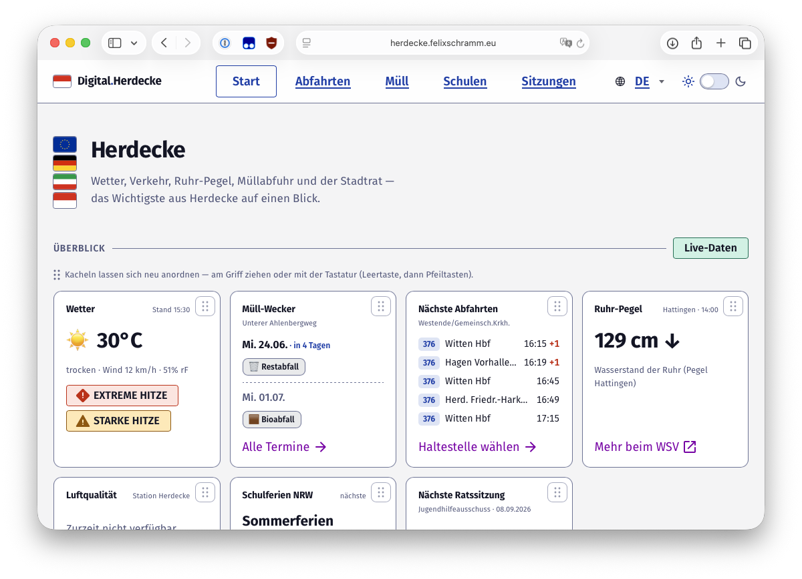

# Digital.Herdecke

[](https://github.com/felsenuboot/herdecke-digital/actions/workflows/ci.yml)

The most useful civic data for **Stadt Herdecke** on one page — live weather &
official DWD warnings, the next public-transport departures, the Ruhr water level,
air quality, the waste calendar, and the city council — plus **keyword alerts** that
email you when your topics (a street, „Radweg", „Kita", the Hengsteysee) appear on a
council agenda. An open civic-tech project built entirely on public open data.



> Status: **working MVP** — a live overview dashboard plus council keyword alerts
> (double opt-in, daily cron email). Runs locally with zero setup; deploy to Vercel
> with Neon + Resend. See [Deploy](#deploy).

## Live data on the homepage

Every source is **keyless** and queried server-side (cached briefly, fails
gracefully per card):

| Card | Source | Notes |
|---|---|---|
| Wetter + Unwetterwarnungen | DWD via **Bright Sky** (`api.brightsky.dev`) | resolves to warn-cell `805954020` (Stadt Herdecke) |
| Nächste Abfahrten | **VRR EFA** (`efa.vrr.de`, rapidJSON) | live departures from any of Herdecke's ~62 stops; pick + save a default at `/abfahrten` |
| Ruhr-Pegel | **PegelOnline** (WSV) | nearest gauge Hattingen (~18.7 km), with 6 h trend |
| Luftqualität | **Umweltbundesamt** Air Data | station „Herdecke" (DENW014, ~2.2 km); best-effort |
| Müll-Wecker | **AHE** (`ahe.atino.net`) | per-street collection dates (Restabfall/Bio/Papier/Gelber Sack) at `/muell` |
| Schulferien NRW | **OpenHolidays API** | next school holidays; full list + Herdecke school directory at `/schulen` |
| Nächste Ratssitzung | SessionNet (this repo's scraper) | next meeting + agenda preview |

Source clients live in `src/lib/sources/*`; cards in `src/app/components/cards.tsx`.

## Why

Herdecke's council data lives in a Somacos **SessionNet** portal that nobody checks
and that exposes **no OParl API**. Decisions affecting your street are public but
practically invisible. Digital.Herdecke turns that portal into a subscribable feed.

## How it works

```
SessionNet portal ──▶ scraper (src/sessionnet.ts) ──▶ agenda items
                                                          │
   your keywords ──▶ matcher (src/match.ts) ─────────────┘
                                                          ▼
                                              email alert on a match
```

### Data source map (verified June 2026)

The portal is `https://sessionnet.owl-it.de/herdecke/bi/`. No OParl — we read HTML.

| Page | Purpose |
|---|---|
| `si0040.asp?__cjahr=Y&__cmonat=M&__canz=1&__cselect=0` | month calendar (near-term meetings) |
| `info.asp` (`yvcs.asp` links) | "next sessions" widget (announced future meetings + ids) |
| `si0057.asp?__ksinr=<id>` | a meeting and its agenda items (TOPs) |
| `vo0050.asp?__kvonr=<id>` | a Vorlage (paper) with a clean Betreff |
| `getfile.asp?id=<id>&type=do` | a document (PDF) |
| `rssfeed.asp` | "what's new" feed |

Each agenda item exposes: TOP number, **Betreff** (the matchable subject),
public/non-public flag, optional Vorlage, and attached documents.

## Core modules

- **`src/sessionnet.ts`** — framework-agnostic client + parser. Lists upcoming
  meetings (calendar + announced), fetches a meeting's agenda, reads the RSS feed.
  Polite by default: descriptive User-Agent with a contact, timeouts, resilient to
  a single source failing.
- **`src/match.ts`** — German-aware matching. Folds umlauts/ß and case so
  `Bahnhofstrasse` matches `Bahnhofstraße`.
- **`src/scan.ts`** — CLI to verify extraction/matching against the live site.

## Design system

The UI is built on **KERN**, the German government's open design system
([pattern library](https://gitlab.opencode.de/kern-ux/pattern-library), EUPL-1.2),
via the React kit [`@publicplan/kern-react-kit`](https://www.npmjs.com/package/@publicplan/kern-react-kit)
(which wraps `@kern-ux/native`). Buttons, badges, inputs and the select are the kit's
own components; colours, typography (Fira Sans) and light/dark theming come from KERN
design **tokens** (`--kern-color-*`) — so the app tracks KERN upstream instead of
re-implementing it.

- KERN components cross a single client boundary in `src/app/components/kern.tsx`;
  Server Components render them as islands with serializable props.
- `src/app/globals.css` bridges the app's own bespoke layout (cards, lists, flags)
  onto KERN tokens; **dark mode flips automatically** via the `data-kern-theme`
  attribute on `<html>` — there is no hand-maintained dark palette.
- The kit is a local `file:` dependency installed with `install-links=true` (see
  `.npmrc`) so `@kern-ux/native` resolves under Turbopack; re-run `npm install`
  after updating the kit. A credit link sits in the site footer.

## Usage

```bash
npm install

# List upcoming meetings
npm run scan -- --list --months 4

# Scan published agendas for keywords
npm run scan -- --keywords "Radweg,Kita,Klima,Hengsteysee,Haushalt" --months 4

# Machine-readable
npm run scan -- --keywords "Radweg" --json

npm run typecheck

# Web app — local dev (JSON store + console emails, no accounts needed)
npm run dev            # http://localhost:3000

# Exercise the full alert pipeline from the CLI
npm run pipeline -- --add du@example.com "Hengsteysee,Radweg,Kita"
npm run pipeline       # scan + "send" (prints emails to console in dev)
```

Example (real output, Rat 18.06.2026):

```
📅  Rat — 2026-06-18
    • TOP Ö 20  [Hengstey]
        Machbarkeitsstudie Koepchenwerk Weiterentwicklung des Naturraums Hengsteysee
    • TOP Ö 21  [Klima]
        Bundesprogramm „Anpassung … an den Klimawandel" Bewerbung auf Fördermittel
```

## Roadmap

1. **Core engine** ✅ — live extraction + German keyword matching.
2. **Web app (Next.js)** ✅ — upcoming meetings & agenda pages, a subscribe form
   with **double opt-in**, confirm/unsubscribe, Impressum/Datenschutz scaffolds.
3. **Persistence** ✅ — pluggable store: local JSON file for dev, **Postgres**
   (Neon) in production. (No `@vercel/postgres`/`@vercel/kv` — those are sunset.)
4. **Scheduled scan** ✅ — `vercel.json` cron hits `/api/cron/scan` daily; it
   matches agenda items to subscriptions and emails via **Resend**. Idempotent:
   never alerts twice for the same (subscriber, item).
5. **Civic dashboard ("Digital.Herdecke")** ✅ — homepage overview with live
   weather + DWD warnings, VRR departures, Ruhr pegel, air quality, waste links,
   and a next-meeting agenda preview. See [Live data](#live-data-on-the-homepage).
6. **Müll-Wecker** ✅ — per-street waste schedule at `/muell` from live AHE data
   (`ahe.atino.net`: CSRF token → PLZ/city/street resolution → iCal parse).
7. **Schulen & Ferien** ✅ — Herdecke school directory (NRW Schulgrunddaten,
   filtered by AGS `05954020` with the official Schulform key) + upcoming NRW
   school holidays (OpenHolidays API) at `/schulen`, plus a dashboard card.
8. **Abfahrten** ✅ — pick any of Herdecke's ~62 stops (EFA 9 km coordinate search,
   filtered to locality Herdecke), live board at `/abfahrten`, with a saved default
   stop reflected on the homepage card. Departures addressed by global id (`de:05954:NNNN`).
9. **Müll-Wecker reminders** ✅ — opt-in *email* reminders the evening before a
   collection (double opt-in on `/muell`; evening cron `/api/cron/waste`). Reuses
   the same store + idempotency as the council alerts.
10. **CI** ✅ — GitHub Actions runs typecheck + build on every push/PR.
11. **Next** — subscribable **flood / severe-weather alerts** for Herdecke (the data
    is already wired into the dashboard); council per-committee filters & daily digest.
12. **Council archive search** — make past council meetings, agendas and decisions
    **full-text searchable** (the SessionNet portal offers neither search nor an
    OParl API); index scraped agenda items so residents can look up a street, topic,
    or past decision across previous sessions.
13. **Upgrade the KERN kit** — bump `@publicplan/kern-react-kit` from the pinned
    `1.0.1` to the latest **1.3.5** (re-verify component props + dark-mode tokens
    first). Pinned for now so the Vercel build is reproducible from npm.
14. **Adopt KERN's official "Method 1" npm integration** — install `@kern-ux/native`
    directly and import its CSS (`@import "@kern-ux/native/dist/kern.min.css"` +
    `".../fonts/fira-sans.css"`, per kern-ux.de), decoupling the design tokens/CSS
    from the React kit.

## Deploy

### Read-only dashboard (default — zero config)

By default `NEXT_PUBLIC_SUBSCRIPTIONS_ENABLED` is off, so the site stores **no user
data**: weather, departures, river level, air, waste lookup, schools and the council
viewer are all read-only public data. That means a one-command deploy with **no env
vars and no database**:

```bash
npm i -g vercel
vercel --prod
```

Add your own domain in the Vercel dashboard (Settings → Domains) and set
`APP_URL=https://your-domain` so internal links are correct.

### Enable the e-mail features later

Council keyword alerts + the Müll-Wecker reminders are built but disabled. Turn them
on once you have an Impressum, a Datenschutzerklärung, a verified sending domain and
the data-processing agreements (Resend/Neon):

1. **Database** — add a Neon Postgres integration (EU region) from the Vercel
   Marketplace; it injects `DATABASE_URL`. Tables are created on first run.
2. **Email** — create a [Resend](https://resend.com) API key, verify a sending
   domain, set `RESEND_API_KEY` and `EMAIL_FROM` (e.g. `Digital.Herdecke <alerts@your-domain>`).
3. **Secrets** — `APP_URL`, a random `CRON_SECRET`, and `NEXT_PUBLIC_SUBSCRIPTIONS_ENABLED=true`.
4. **Fill in** `Impressum` and `Datenschutz` (placeholders in `src/app/`).
5. **Restore the cron jobs** — create `vercel.json`:
   ```json
   {
     "$schema": "https://openapi.vercel.sh/vercel.json",
     "crons": [
       { "path": "/api/cron/scan", "schedule": "0 6 * * *" },
       { "path": "/api/cron/waste", "schedule": "0 16 * * *" }
     ]
   }
   ```
6. `vercel --prod`. Trigger a manual run with
   `curl -H "Authorization: Bearer $CRON_SECRET" https://<app>/api/cron/scan`.

## Operating notes

- **Data is public**, but be a good neighbour: low request rate, honest UA with a
  contact, cache aggressively. Consider emailing the Stadt / OWL-IT to introduce
  the service — they may link or even host it.
- **GDPR**: subscriber emails are personal data — double opt-in, easy unsubscribe,
  a plain-language privacy note, and store only what's needed.
- **Best-effort**: the portal can change its HTML; the scraper is selector-based
  and may need occasional upkeep. Alerts are informational, not authoritative —
  always link back to the official agenda.
- The `src/sessionnet.ts` client generalises to other SessionNet towns (Hagen,
  Witten, …) by swapping the base URL — room to grow this into an EN-Kreis service.

## License

MIT (code). Council data © Stadt Herdecke, accessed via the public portal.
